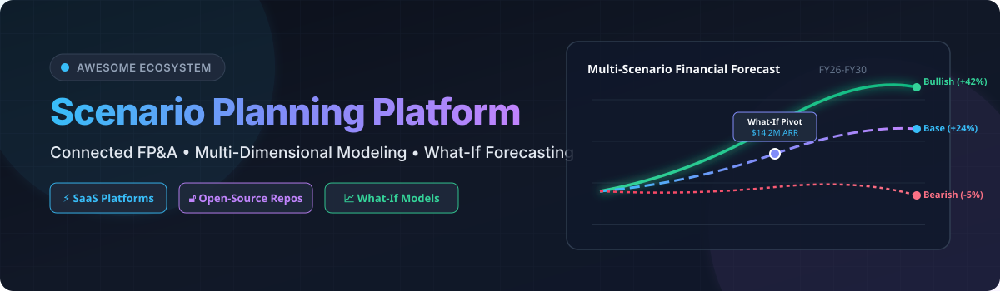

  

  
  
  
  
  
  

# 🚀 Awesome Scenario Planning Platform Ecosystem

> **Curated List of Enterprise SaaS Platforms & Open-Source GitHub Projects**  
> *Focused on FP&A, Connected Planning, Multi-Dimensional Modeling, Budgeting, Financial Forecasting & What-If Scenario Analysis*

**Last updated: September 2026** 📅

---

## 📌 Executive Overview & Key Keywords

Welcome to the **Awesome Scenario Planning Platform** directory! This repository serves as the definitive reference guide for CFOs, FP&A leaders, financial modelers, strategic planners, and analytics engineers looking for top-tier **Scenario Planning**, **Financial Planning & Analysis (FP&A)**, and **Corporate Performance Management (CPM)** platforms. 

Whether you are seeking enterprise-grade commercial platforms (like Workday Adaptive Planning, Anaplan, Pigment, OneStream) or powerful open-source time-series, forecasting, and data transformation libraries (like Prophet, Odoo, ERPNext, Actual Budget, Darts, Cube), this list covers the spectrum of modern connected planning.

---

## 📑 Table of Contents

- [🏢 SaaS & Commercial Hosted Platforms](#-saas--commercial-hosted-platforms)
- [🔓 Open-Source GitHub Projects & Libraries](#-open-source-github-projects--libraries)
- [🤝 How to Contribute](#-how-to-contribute)
- [🛡️ Disclaimer & Governance](#-disclaimer--governance)
- [📈 Star History](#-star-history)

---

## 🏢 SaaS & Commercial Hosted Platforms

📊 **Market Size & Industry Structure**: The global Scenario Planning and Financial Planning & Analysis (FP&A) software market is estimated at **$4.5B–$6.5B (projected to reach $10B+ by 2030 at an 11–13% CAGR)**. The sector is **moderately fragmented**—it is not a single winner-take-all market. Enterprise monoliths dominate complex global Fortune 500 deployments, while fast-growing, spreadsheet-native mid-market platforms capture agile SaaS, SMB, and growth-stage companies based on ease of integration and UI preference.

Below is a comparative breakdown of top commercial SaaS scenario planning platforms, **sorted by company size / valuation (descending)**:

| Platform | Description | Company Size (Valuation / Revenue / Market Cap) | Pricing (Starting Tier) | Free Tier / Free Trial Limit |
| :--- | :--- | :--- | :--- | :--- |
| 💼 **[Workday Adaptive Planning](https://www.workday.com/en-us/products/financial-management/adaptive-planning.html)** | Enterprise connected planning tool for financial, workforce, and operational modeling and what-if scenario analysis. | **~$60.0B** Market Cap (Parent WDAY) / ~$300M+ ARR | Starting at ~$22,000 / year | No free tier; 30-day free trial (Full-access trial upon request) |
| 🌐 **[Anaplan](https://www.anaplan.com/)** | Enterprise standard for connected planning at scale, supporting complex multi-dimensional models across finance, sales, supply chain, and workforce. | **~$10.7B** Valuation (Acquired by Thoma Bravo) / ~$600M+ Revenue | Starting at ~$30,000 / year | No commercial free tier or trial (0 days limit; 90-day free trial workspace for Talent Builder learners) |
| ⚡ **[OneStream](https://www.onestream.com/)** | Enterprise corporate performance management platform consolidating financial reporting, budgeting, forecasting, and multi-scenario modeling. | **~$5.9B** Market Cap (NASDAQ: OS) / ~$450M+ Revenue | Starting at ~$50,000 / year | No free tier; No free trial (0 days limit, executive demo on request) |
| 🎨 **[Pigment](https://www.pigment.com/)** | Modern, AI-native connected planning platform popular with mid-market and growth companies for flexible modeling, rapid scenario building, and cross-functional collaboration. | **$1.0B+** Valuation (Unicorn Series D) / ~$50M+ ARR | Starting at ~$30,000 / year | No free tier; No free trial (0 days limit, demo request only) |
| 📊 **[Vena](https://www.venasolutions.com/)** | Excel-native planning and performance management platform that brings governance, collaboration, and scenario capabilities to familiar spreadsheet workflows. | **~$500M+** Valuation ($300M+ Funding) / ~$80M+ Revenue | Starting at ~$10,000 / year | No free tier; No free trial (0 days limit, guided demo on request) |
| 📋 **[Planful](https://planful.com/)** | Continuous planning and FP&A platform strong in mid-market budgeting, forecasting, consolidation, and structured planning processes. | **~$400M+** Valuation (PE-backed Vector Capital) / ~$100M+ Revenue | Starting at ~$25,000 / year | No free tier; No free trial (0 days limit, sales demo on request) |
| 🏢 **[Prophix](https://www.prophix.com/)** | Corporate performance management and budgeting/forecasting platform serving mid-market organizations with structured planning and automation. | **~$400M+** Valuation (PE-backed Hg Capital) / ~$100M+ Revenue | Starting at ~$50,000 / year | No free tier; No hands-on free trial (0 days limit, self-guided interactive online demo) |
| 📑 **[Datarails](https://www.datarails.com/)** | Excel-based FP&A and reporting solution that automates data collection and supports scenario and variance analysis for finance teams. | **~$400M** Valuation (Series B) / ~$30M+ ARR | Starting at ~$20,000 / year | No free tier; No standard free trial (0 days limit, custom proof-of-concept upon demo) |
| 🧊 **[Cube](https://www.cubesoftware.com/)** | Spreadsheet-native FP&A platform focused on consolidating data, enabling scenario analysis, and keeping finance teams in Excel/Google Sheets while adding control. | **~$150M+** Valuation (Series B) / ~$15M+ ARR | Starting at $1,250 / month (~$15,000 / year) | No free tier; No free trial (0 days limit, sales demo on request) |
| 🎯 **[Abacum](https://www.abacum.io/)** | FP&A platform tailored to SaaS and high-growth companies, emphasizing metrics, board reporting, and agile planning. | **~$100M+** Valuation (Series A/B) / ~$10M+ ARR | Starting at ~$15,000 / year (~$1,250 / month) | No free tier; 7-day limited evaluation trial / sales-led demo |
| 🧩 **[Mosaic](https://www.mosaic.tech/)** | Strategic finance and FP&A platform built for SaaS companies to automate modeling, real-time analytics, and forecasting. | **~$100M+** Valuation (Series B) / ~$10M+ ARR | Starting at $2,000 / month (~$24,000 / year) | No free tier; No standard free trial (0 days limit, product demo on request) |
| 💡 **[Centage](https://www.centage.com/)** | Automated budgeting, forecasting, and financial reporting platform (Planning Maestro) tailored for SMBs and mid-market finance teams. | **~$75M–$100M** Valuation (PE-backed) / ~$20M+ Revenue | Starting at $1,750 / month (Core plan, billed annually) | No free tier; No free trial (0 days limit, live demo on request) |

---

## 🔓 Open-Source GitHub Projects & Libraries

Enterprise-grade connected planning platforms are predominantly commercial. However, open-source projects excel in specialized forecasting algorithms, personal/SMB budgeting engines, ERP financial modules, and analytics modeling stacks.

Below are top open-source projects relevant to scenario planning and financial modeling, **sorted by GitHub star counts (descending)**:

1. 🌟 **[Odoo Budgeting & Accounting](https://github.com/odoo/odoo)**  
     
   Open-source ERP suite featuring integrated financial accounting, multi-currency budgeting, cost center reporting, and operational scenario tracking.

2. 🌟 **[ERPNext](https://github.com/frappe/erpnext)**  
     
   Full-featured open-source ERP platform with built-in financial budgeting, cost analytics, cash-flow forecasting, and multi-company consolidation.

3. 🌟 **[Actual Budget](https://github.com/actualbudget/actual)**  
     
   Super fast, local-first open-source financial management and privacy-focused budgeting system with zero-based budgeting and custom rules.

4. 🌟 **[Firefly III](https://github.com/firefly-iii/firefly-iii)**  
     
   Self-hosted manager for personal and small business financial tracking, recurring budget rules, and multi-scenario expense projections.

5. 🌟 **[Cube Semantic Layer](https://github.com/cube-js/cube)**  
     
   Universal semantic layer for analytics and financial data modeling, generating pre-aggregations for multi-dimensional FP&A metrics.

6. 🌟 **[Prophet](https://github.com/facebook/prophet)**  
     
   Open-source automated time-series forecasting procedure designed for business forecasts, scenario simulations, and trend modeling.

7. 🌟 **[dbt-core](https://github.com/dbt-labs/dbt-core)**  
     
   Analytics engineering framework used to transform, model, and govern financial datasets for downstream scenario planning platforms.

8. 🌟 **[FinRL](https://github.com/AI4Finance-Foundation/FinRL)**  
     
   Open-source framework for financial reinforcement learning and multi-scenario portfolio/allocation simulations.

9. 🌟 **[Statsmodels](https://github.com/statsmodels/statsmodels)**  
     
   Python module providing classes and functions for statistical modeling, econometrics, and financial scenario simulations.

10. 🌟 **[Darts](https://github.com/unit8co/darts)**  
      
    Python library for user-friendly forecasting and time-series scenario modeling using statistical, machine learning, and deep learning models.

11. 🌟 **[BankProjections](https://github.com/woutersolutions/BankProjections)**  
      
    Open-source balance-sheet forecasting and stress-testing scenario engine tailored for banks and financial institutions.

---

## 🤝 How to Contribute

We welcome community contributions to keep this ecosystem current!

1. 🍴 **Fork** the repository.
2. ✍️ **Add/edit** entries in `README.md` following the established table or list format.
3. 📝 **Include**: Name, official site link, clear description, pricing tier, free limits, or GitHub star badge.
4. 🚀 **Submit** a Pull Request with a brief summary of additions.

See our curated parent list at [Awesome-Awesome-Awesome](https://github.com/ishandutta2007/Awesome-Awesome-Awesome).

---

## 🛡️ Disclaimer & Governance

- This is a **community-curated list** — not exhaustive and not an endorsement.
- Scenario planning and FP&A systems directly influence key business decisions and financial reporting. Model accuracy, data security, access controls, and audit trails are critical.
- Open-source tools require internal engineering expertise and testing. They supplement, rather than replace, established commercial platforms in heavily regulated enterprise environments.

---

## 📈 Star History

---

  <b>Made with ❤️ for FP&A teams, CFOs, financial analysts, and strategic planners.</b>

